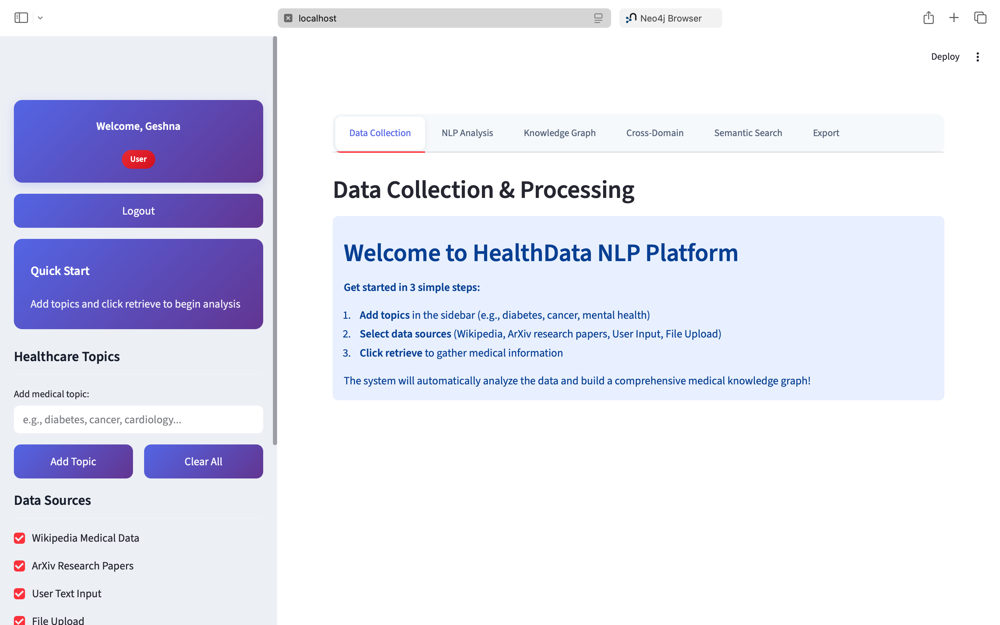
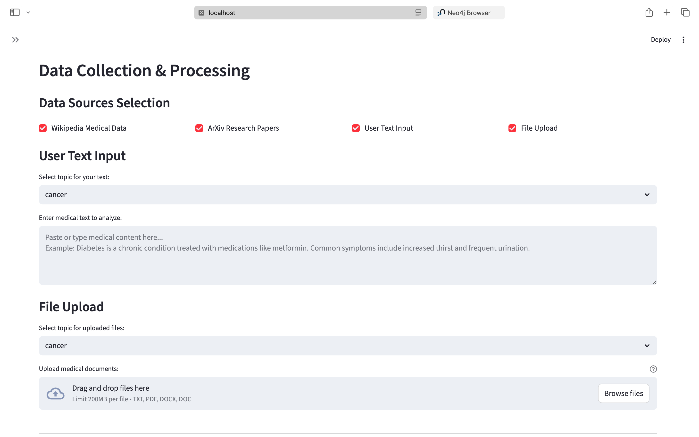
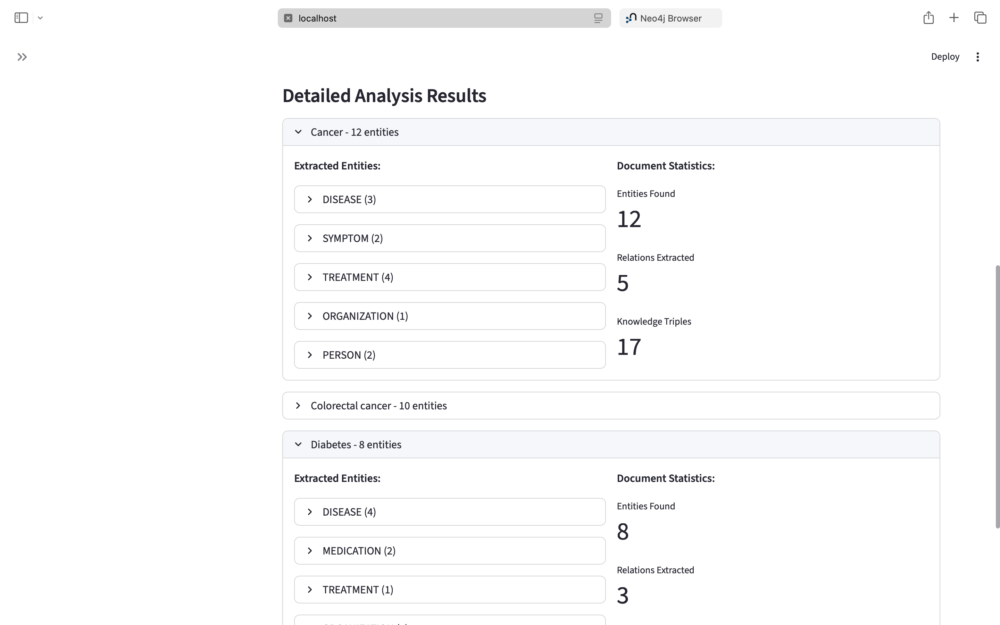
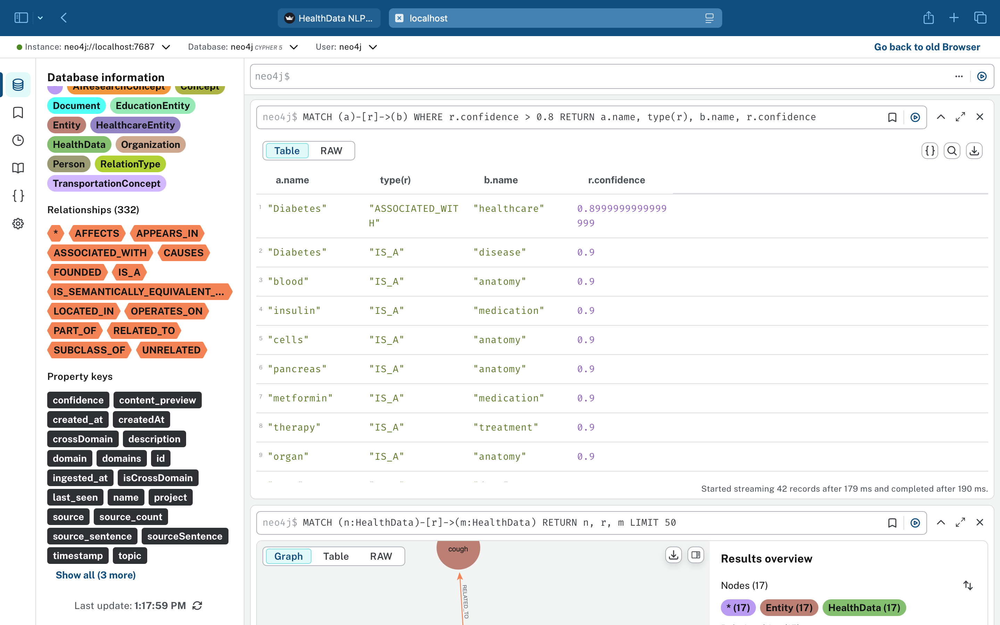
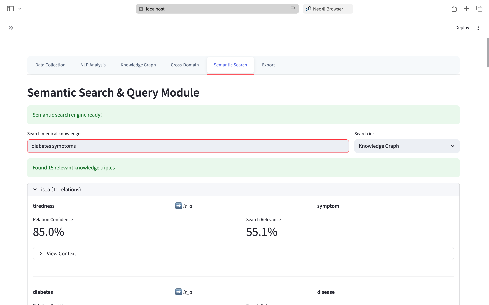
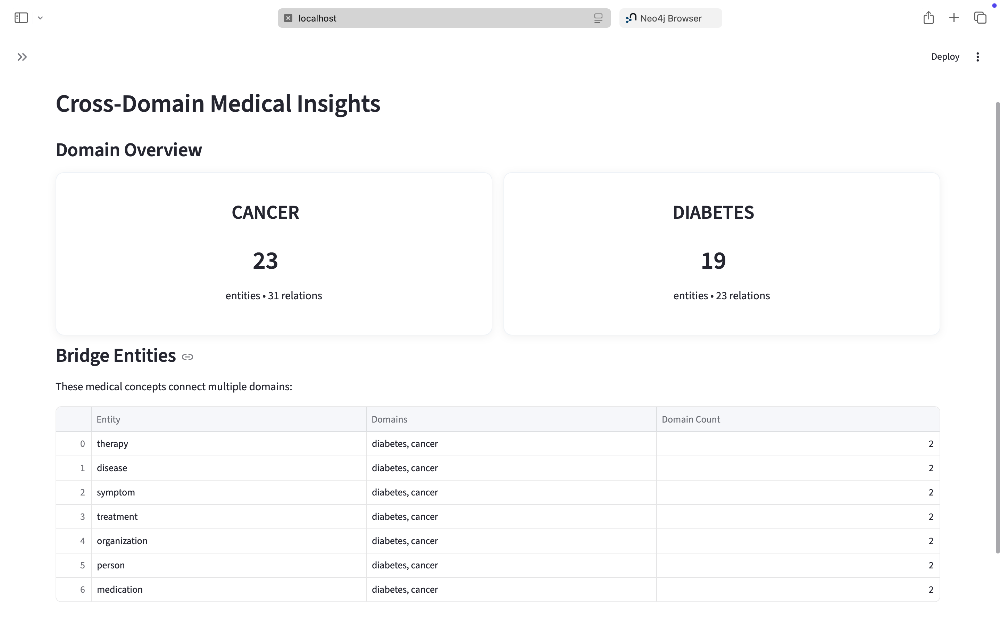

# 🧠 Health Data NLP Platform

An AI-powered platform that extracts and analyzes medical information from unstructured text using Natural Language Processing and Machine Learning.

---

## 🚀 Features

- 🔍 **Medical Entity Extraction**
  - Detects diseases, symptoms, medications, and procedures

- 🔗 **Relationship Extraction**
  - Identifies relationships between entities (e.g., treatment, causes)

- 🧩 **Knowledge Graph Visualization**
  - Converts extracted data into structured graph format

- 🔎 **Semantic Search**
  - Retrieves relevant medical information based on meaning (not just keywords)

- 🔐 **User Authentication**
  - Secure login and registration system

---

## 🛠️ Tech Stack

- **Frontend**: Streamlit  
- **Backend**: Python  
- **NLP Libraries**: spaCy, Transformers  
- **ML Models**: Sentence-BERT  
- **Graph Processing**: NetworkX  
- **Database**: SQLite  

---

## 📸 Output Screenshots








---

## ⚙️ Installation & Setup

```bash
# Clone repository
git clone https://github.com/your-username/health-nlp-platform.git

# Go to project folder
cd health-nlp-platform

# Create virtual environment
python3.11 -m venv venv

# Activate environment
source venv/bin/activate

# Install dependencies
pip install -r requirements.txt

# Run the app
python -m streamlit run app.py
